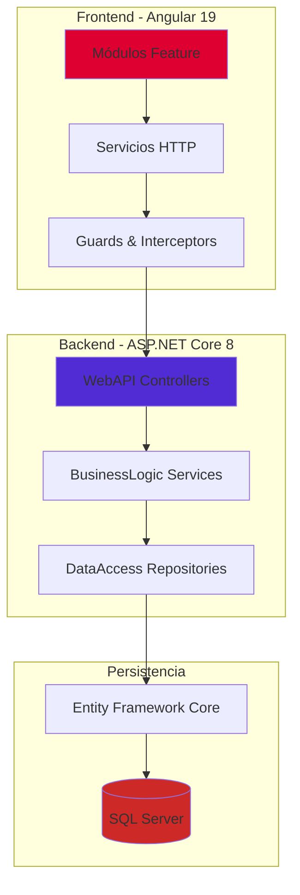

# Portal DGC - Sistema de Postulación a Concursos Públicos

[](https://dotnet.microsoft.com/)
[](https://angular.io/)
[](https://www.microsoft.com/sql-server)
[](LICENSE)

> **Trabajo Integrador - Universidad ORT Uruguay**  
> **Autor:** Gabriel Lutz (173507)  
> **Tutor:** Ing. Alejandro Adorjan  
> **Coordinador:** Ing. Cecilia Beletti

---

## 📋 Tabla de Contenidos

- [Descripción del Proyecto](#-descripción-del-proyecto)
- [Contexto y Problemática](#-contexto-y-problemática)
- [Arquitectura del Sistema](#-arquitectura-del-sistema)
- [Stack Tecnológico](#-stack-tecnológico)
- [Requisitos Previos](#-requisitos-previos)
- [Instalación y Configuración](#-instalación-y-configuración)
- [Ejecución del Proyecto](#-ejecución-del-proyecto)
- [Testing](#-testing)
- [Estructura del Proyecto](#-estructura-del-proyecto)
- [Documentación Adicional](#-documentación-adicional)
- [Características Implementadas](#-características-implementadas)
- [Estado del Proyecto](#-estado-del-proyecto)
- [Contribuciones y Contacto](#-contribuciones-y-contacto)

---

## 📖 Descripción del Proyecto

**Portal DGC** es una plataforma web integral que digitaliza y automatiza el proceso de postulación a concursos públicos para la **Dirección General de Casinos del Estado de Uruguay**. El sistema reemplaza procesos manuales realizados presencialmente o por correo electrónico, implementando workflows digitales que aseguran el cumplimiento de leyes de acción afirmativa y estándares de accesibilidad.

### Objetivos Principales

- ✅ **Digitalizar** el proceso completo de inscripción a llamados públicos
- ✅ **Automatizar** el cálculo de cuotas según leyes 19.122, 19.684 y 18.651
- ✅ **Garantizar** accesibilidad WCAG 2.1 AA (Decreto AGESIC 406/022)
- ✅ **Transparentar** el proceso de evaluación y generación de ordenamientos
- ✅ **Reducir** tiempos y errores mediante validaciones automáticas

---

## 🎯 Contexto y Problemática

### Problemática Actual

La DGC gestiona actualmente sus concursos mediante:
- Postulaciones **presenciales** con formularios en papel
- Coordinación manual por **correo electrónico**
- Cálculos de cuotas realizados en **planillas Excel**
- **Falta de trazabilidad** en el proceso de evaluación
- **Baja accesibilidad** para personas con discapacidad

### Solución Propuesta

Portal DGC implementa:
- **Workflow de 6 pasos** guiado para postulantes
- **Dashboard de evaluación** para tribunales con scoring automático
- **Generación automática** de ordenamientos aplicando cuotas
- **Sistema de notificaciones** (planificado)
- **Alto contraste** y navegación accesible (WCAG 2.1 AA)

### Leyes de Cuotas Implementadas

| Ley | Colectivo | Cuota |
|-----|-----------|-------|
| **19.122** | Personas afrodescendientes | 8% |
| **19.684** | Personas trans | 1% |
| **18.651** | Personas con discapacidad | 4% |

---

## 🏗️ Arquitectura del Sistema

El sistema sigue una **arquitectura en capas** (layered architecture) con separación clara de responsabilidades:



### Capas del Backend

```
PortalDGC/
│
├── src/
│   ├── PortalDGC.Domain/          # Entidades de dominio (21 clases)
│   ├── PortalDGC.DataAccess/      # Repositorios + UnitOfWork + EF Context
│   ├── PortalDGC.BusinessLogic/   # Servicios de lógica de negocio
│   └── PortalDGC.WebApi/          # Controllers + DTOs + Swagger
│
└── test/
    ├── UnitTests/                 # 155 unit tests (xUnit + Moq)
    └── IntegrationTests/          # 40 integration tests
```

### Patrones de Diseño Implementados

- **Repository Pattern**: Abstracción del acceso a datos
- **Unit of Work**: Gestión de transacciones consistentes
- **Dependency Injection**: Inversión de control nativa en .NET
- **DTO Pattern**: Separación entre entidades de dominio y transferencia
- **Service Layer**: Encapsulación de lógica de negocio

---

## 🛠️ Stack Tecnológico

### Backend

| Tecnología | Versión | Propósito |
|------------|---------|-----------|
| **.NET** | 8.0 | Framework principal |
| **ASP.NET Core** | 8.0 | Web API REST |
| **Entity Framework Core** | 8.0 | ORM + Migrations |
| **SQL Server** | 2022+ | Base de datos relacional |
| **xUnit** | 2.6+ | Framework de testing |
| **Moq** | 4.20+ | Mocking para tests |
| **Swashbuckle** | 6.5+ | Documentación Swagger/OpenAPI |

### Frontend

| Tecnología | Versión | Propósito |
|------------|---------|-----------|
| **Angular** | 19 | Framework SPA |
| **TypeScript** | 5.5+ | Tipado estático |
| **RxJS** | 7.8+ | Programación reactiva |
| **SCSS** | - | Estilos avanzados |

### Herramientas de Desarrollo

- **Visual Studio 2022 Enterprise** - IDE principal backend
- **Visual Studio Code** - IDE frontend
- **Git Flow** - Estrategia de branching
- **GitHub Projects** - Gestión Kanban
- **Conventional Commits** - Formato de commits
- **Framer** - Prototipado interactivo

---

## ✅ Requisitos Previos

### Software Requerido

```bash
# .NET SDK 8.0 o superior
dotnet --version
# Debe mostrar: 8.0.x

# Node.js 20+ y npm
node --version
# Debe mostrar: v20.x.x

# SQL Server 2022+ (LocalDB, Express o Developer)
# Para LocalDB: https://learn.microsoft.com/sql/database-engine/configure-windows/sql-server-express-localdb
```

### Configuración Opcional

- **Azure Data Studio** o **SQL Server Management Studio** (para gestión de BD)
- **Postman** o **Insomnia** (para testing de API)

---

## 📦 Instalación y Configuración

### 1. Clonar el Repositorio

```bash
git clone https://github.com/GabrielLutz/Trabajo_Integrador_173507.git
cd Trabajo_Integrador_173507
```

### 2. Configurar Backend

#### 2.1. Restaurar Dependencias

```bash
cd PortalDGC
dotnet restore PortalDGC.sln
```

#### 2.2. Configurar Cadena de Conexión

Editar `src/PortalDGC.WebApi/appsettings.json`:

```json
{
  "ConnectionStrings": {
    "DefaultConnection": "Server=(localdb)\\mssqllocaldb;Database=PortalDGC;Trusted_Connection=true;TrustServerCertificate=true"
  }
}
```

> **Nota:** Para entorno `Testing`, se usa base de datos **InMemory** automáticamente.

#### 2.3. Aplicar Migraciones

```bash
cd src/PortalDGC.WebApi
dotnet ef database update
```

### 3. Configurar Frontend

```bash
cd ../../frontend/portal-dgc-app
npm install
```

---

## 🚀 Ejecución del Proyecto

### Opción 1: Backend Standalone

#### Compilar la solución

```bash
cd PortalDGC
dotnet build PortalDGC.sln
```

#### Ejecutar Web API

```bash
cd src/PortalDGC.WebApi
dotnet run
```

La API estará disponible en:
- **HTTPS:** `https://localhost:54073`

#### Acceder a Swagger UI

Una vez iniciada la API, navegar a:
```
https://localhost:54073/swagger
```

### Opción 2: Desarrollo Completo (Backend + Frontend)

#### Terminal 1 - Backend

```bash
cd PortalDGC/src/PortalDGC.WebApi
dotnet watch run
```

#### Terminal 2 - Frontend

```bash
cd frontend/portal-dgc-app
ng serve
```

Acceder a la aplicación en `http://localhost:4200`

---

## 🧪 Testing

El proyecto cuenta con **192 tests** automatizados (152 unitarios + 40 integración).

### Ejecutar Todos los Tests

```bash
cd PortalDGC
dotnet test PortalDGC.sln
```

### Ejecutar Tests con Cobertura

```bash
dotnet test PortalDGC.sln --collect:"XPlat Code Coverage"
```

### Reporte de Cobertura

```bash
# Instalar ReportGenerator (si no está instalado)
dotnet tool install --global dotnet-reportgenerator-globaltool

# Generar reporte HTML
reportgenerator -reports:"test/**/coverage.cobertura.xml" -targetdir:"coveragereport" -reporttypes:Html

# Abrir reporte
start coveragereport/index.html  # Windows
open coveragereport/index.html   # macOS/Linux
```

### Cobertura Actual por Módulo

| Módulo | Cobertura | Tests |
|--------|-----------|-------|
| **DepartamentoService** | 91% | ✅ |
| **InscripcionService** | 89% | ✅ |
| **LlamadoService** | 90% | ✅ |
| **PostulanteService** | 86% | ✅ |
| **TribunalService** | 82% | ✅ |
| **ValidacionService** | 88% | ✅ |
| **ArchivoService** | 84% | ✅ |
| **ConstanciaService** | 87% | ✅ |

---

## Documentación automática

- `PortalDGC.BusinessLogic` y `PortalDGC.WebApi` generan archivos XML de comentarios en `bin/Debug/net8.0/`.
- `Program.cs` agrega automáticamente esos archivos mediante `IncludeXmlComments`, por lo que Swagger muestra los resúmenes de clases y endpoints.
- Con la API levantada, la documentación interactiva queda disponible en `https://localhost:54073/swagger`.

---

## 📁 Estructura del Proyecto

### Backend - Organización por Capas

```
PortalDGC/
│
├── src/
│   │
│   ├── PortalDGC.Domain/                    # 🟦 Capa de Dominio
│   │   ├── Entities/                        # Entidades del modelo
│   │   │   ├── Llamado.cs
│   │   │   ├── Inscripcion.cs
│   │   │   ├── Postulante.cs
│   │   │   ├── Prueba.cs
│   │   │   ├── MeritoPostulante.cs
│   │   │   ├── RequisitoPostulante.cs
│   │   │   ├── ApoyoSolicitado.cs
│   │   │   ├── AutodefinicionLey.cs
│   │   │   ├── Ordenamiento.cs
│   │   │   └── ... (21 entidades en total)
│   │   │
│   │   └── PortalDGC.Domain.csproj
│   │
│   ├── PortalDGC.DataAccess/                # 🟨 Capa de Acceso a Datos
│   │   ├── Context/
│   │   │   ├── ApplicationDbContext.cs      # EF DbContext principal
│   │   │   └── DbInitializer.cs             # Seed data inicial
│   │   │
│   │   ├── Repositories/                    # Implementaciones de repositorios
│   │   │   ├── Repository.cs                # Repositorio genérico base
│   │   │   ├── LlamadoRepository.cs
│   │   │   ├── InscripcionRepository.cs
│   │   │   ├── PostulanteRepository.cs
│   │   │   └── ... (14 repositorios)
│   │   │
│   │   ├── Interfaces/                      # Contratos de repositorios
│   │   │   ├── IRepository.cs
│   │   │   ├── ILlamadoRepository.cs
│   │   │   └── ... (14 interfaces)
│   │   │
│   │   ├── UnitOfWork.cs                    # Patrón Unit of Work
│   │   └── PortalDGC.DataAccess.csproj
│   │
│   ├── PortalDGC.BusinessLogic/             # 🟩 Capa de Lógica de Negocio
│   │   ├── Services/                        # Servicios principales
│   │   │   ├── LlamadoService.cs            # Gestión de llamados
│   │   │   ├── InscripcionService.cs        # Workflow de inscripción
│   │   │   ├── PostulanteService.cs         # Gestión de postulantes
│   │   │   ├── TribunalService.cs           # Evaluación y ordenamientos
│   │   │   ├── ValidacionService.cs         # Validaciones de negocio
│   │   │   ├── ArchivoService.cs            # Gestión de archivos
│   │   │   ├── ConstanciaService.cs         # Upload constancias
│   │   │   └── DepartamentoService.cs       # Catálogo departamentos
│   │   │
│   │   ├── Interfaces/                      # Contratos de servicios
│   │   │   ├── ILlamadoService.cs
│   │   │   ├── IInscripcionService.cs
│   │   │   └── ... (8 interfaces)
│   │   │
│   │   └── PortalDGC.BusinessLogic.csproj
│   │
│   └── PortalDGC.WebApi/                    # 🟪 Capa de Presentación (API)
│       ├── Controllers/                     # Endpoints REST
│       │   ├── LlamadoController.cs         # GET /api/llamados
│       │   ├── InscripcionController.cs     # POST /api/inscripciones
│       │   ├── PostulanteController.cs      # GET /api/postulantes/{id}
│       │   ├── TribunalController.cs        # POST /api/tribunal/ordenamientos
│       │   ├── ConstanciaController.cs      # POST /api/constancias
│       │   └── DepartamentoController.cs    # GET /api/departamentos
│       │
│       ├── DTOs/                            # Data Transfer Objects
│       │   ├── Request/                     # DTOs de entrada
│       │   │   ├── CrearInscripcionDto.cs
│       │   │   ├── GenerarOrdenamientoDto.cs
│       │   │   └── ...
│       │   │
│       │   └── Response/                    # DTOs de salida
│       │       ├── LlamadoDetalleDto.cs
│       │       ├── InscripcionResponseDto.cs
│       │       └── ...
│       │
│       ├── Program.cs                       # Configuración DI + Middleware
│       ├── appsettings.json                 # Configuración base
│       ├── appsettings.Development.json     # Config desarrollo
│       └── PortalDGC.WebApi.csproj
│
├── test/
│   ├── PortalDGC.UnitTests/                 # 🧪 Tests Unitarios (155)
│   │   ├── Services/
│   │   │   ├── LlamadoServiceTests.cs
│   │   │   ├── InscripcionServiceTests.cs
│   │   │   ├── TribunalServiceTests.cs
│   │   │   └── ... (8 archivos)
│   │   │
│   │   └── PortalDGC.UnitTests.csproj
│   │
│   └── PortalDGC.IntegrationTests/          # 🔗 Tests de Integración (40)
│       ├── Controllers/
│       │   ├── LlamadoControllerTests.cs
│       │   ├── InscripcionControllerTests.cs
│       │   └── ... (6 archivos)
│       │
│       ├── CustomWebApplicationFactory.cs   # Factory para testing
│       ├── TestDataSeeder.cs                # Datos de prueba
│       └── PortalDGC.IntegrationTests.csproj
│
├── PortalDGC.sln                            # Solución principal
└── README.md
```

### Frontend - Arquitectura Modular Angular

```
frontend/portal-dgc-app/
│
├── src/
│   ├── app/
│   │   │
│   │   ├── core/                            # 🟦 Módulo Core (singleton)
│   │   │   ├── services/
│   │   │   │   ├── api.service.ts           # Cliente HTTP base
│   │   │   │   ├── auth.service.ts          # Autenticación (planificado)
│   │   │   │   ├── llamado.service.ts
│   │   │   │   ├── inscripcion.service.ts
│   │   │   │   ├── postulante.service.ts
│   │   │   │   ├── tribunal.service.ts
│   │   │   │   ├── departamento.service.ts
│   │   │   │   └── constancia.service.ts
│   │   │   │
│   │   │   ├── guards/
│   │   │   │   └── auth.guard.ts            # Protección de rutas
│   │   │   │
│   │   │   ├── interceptors/
│   │   │   │   └── http-error.interceptor.ts # Manejo de errores
│   │   │   │
│   │   │   ├── models/                      # Interfaces TypeScript
│   │   │   │   ├── llamado.model.ts
│   │   │   │   ├── inscripcion.model.ts
│   │   │   │   ├── postulante.model.ts
│   │   │   │   ├── tribunal.models.ts
│   │   │   │   ├── departamento.model.ts
│   │   │   │   ├── constancia.model.ts
│   │   │   │   └── api-response.model.ts
│   │   │   │
│   │   │   └── core.module.ts
│   │   │
│   │   ├── features/                        # 🟨 Módulos por Funcionalidad
│   │   │   │
│   │   │   ├── auth/                        # Autenticación
│   │   │   │   ├── login/
│   │   │   │   │   ├── login.component.ts
│   │   │   │   │   ├── login.component.html
│   │   │   │   │   └── login.component.scss
│   │   │   │   │
│   │   │   │   ├── registro/
│   │   │   │   │   ├── registro.component.ts
│   │   │   │   │   ├── registro.component.html
│   │   │   │   │   └── registro.component.scss
│   │   │   │   │
│   │   │   │   └── auth.module.ts
│   │   │   │
│   │   │   ├── llamado/                     # Gestión de Llamados
│   │   │   │   ├── lista-llamados/
│   │   │   │   │   ├── lista-llamados.component.ts
│   │   │   │   │   ├── lista-llamados.component.html
│   │   │   │   │   └── lista-llamados.component.scss
│   │   │   │   │
│   │   │   │   ├── detalle-llamado/
│   │   │   │   │   ├── detalle-llamado.component.ts
│   │   │   │   │   ├── detalle-llamado.component.html
│   │   │   │   │   └── detalle-llamado.component.scss
│   │   │   │   │
│   │   │   │   ├── llamado-routing.module.ts
│   │   │   │   └── llamado.module.ts
│   │   │   │
│   │   │   ├── inscripcion/                 # Workflow Inscripción (6 pasos)
│   │   │   │   ├── formulario-inscripcion/
│   │   │   │   │   ├── formulario-inscripcion.component.ts
│   │   │   │   │   ├── formulario-inscripcion.component.html
│   │   │   │   │   ├── formulario-inscripcion.component.scss
│   │   │   │   │   │
│   │   │   │   │   ├── pasos/
│   │   │   │   │   │   ├── paso-datos-personales/
│   │   │   │   │   │   │   ├── paso-datos-personales.component.ts
│   │   │   │   │   │   │   ├── paso-datos-personales.component.html
│   │   │   │   │   │   │   └── paso-datos-personales.component.scss
│   │   │   │   │   │   │
│   │   │   │   │   │   ├── paso-requisitos/
│   │   │   │   │   │   │   ├── paso-requisitos.component.ts
│   │   │   │   │   │   │   ├── paso-requisitos.component.html
│   │   │   │   │   │   │   └── paso-requisitos.component.scss
│   │   │   │   │   │   │
│   │   │   │   │   │   ├── paso-meritos/
│   │   │   │   │   │   ├── paso-apoyos/
│   │   │   │   │   │   ├── paso-autodefinicion/
│   │   │   │   │   │   └── paso-confirmacion/
│   │   │   │   │
│   │   │   │   ├── detalle-inscripcion/
│   │   │   │   │   ├── detalle-inscripcion.component.ts
│   │   │   │   │   ├── detalle-inscripcion.component.html
│   │   │   │   │   └── detalle-inscripcion.component.scss
│   │   │   │   │
│   │   │   │   ├── inscripcion-routing.module.ts
│   │   │   │   └── inscripcion.module.ts
│   │   │   │
│   │   │   ├── postulante/                  # Panel del Postulante
│   │   │   │   ├── perfil/
│   │   │   │   │   ├── perfil.component.ts
│   │   │   │   │   ├── perfil.component.html
│   │   │   │   │   └── perfil.component.scss
│   │   │   │   │
│   │   │   │   ├── datos-personales/
│   │   │   │   │   ├── datos-personales.component.ts
│   │   │   │   │   ├── datos-personales.component.html
│   │   │   │   │   └── datos-personales.component.scss
│   │   │   │   │
│   │   │   │   ├── mis-inscripciones/
│   │   │   │   │   ├── mis-inscripciones.component.ts
│   │   │   │   │   ├── mis-inscripciones.component.html
│   │   │   │   │   └── mis-inscripciones.component.scss
│   │   │   │   │
│   │   │   │   ├── postulante-routing.module.ts
│   │   │   │   └── postulante.module.ts
│   │   │   │
│   │   │   └── tribunal/                    # Dashboard Tribunal
│   │   │       ├── dashboard-tribunal/
│   │   │       │   ├── dashboard-tribunal.component.ts
│   │   │       │   ├── dashboard-tribunal.component.html
│   │   │       │   └── dashboard-tribunal.component.scss
│   │   │       │
│   │   │       ├── lista-inscripciones/
│   │   │       │   ├── lista-inscripciones.component.ts
│   │   │       │   ├── lista-inscripciones.component.html
│   │   │       │   └── lista-inscripciones.component.scss
│   │   │       │
│   │   │       ├── detalle-evaluacion/
│   │   │       │   ├── detalle-evaluacion.component.ts
│   │   │       │   ├── detalle-evaluacion.component.html
│   │   │       │   └── detalle-evaluacion.component.scss
│   │   │       │
│   │   │       ├── generar-ordenamiento/
│   │   │       │   ├── generar-ordenamiento.component.ts
│   │   │       │   ├── generar-ordenamiento.component.html
│   │   │       │   └── generar-ordenamiento.component.scss
│   │   │       │
│   │   │       ├── ver-ordenamiento/
│   │   │       │   ├── ver-ordenamiento.component.ts
│   │   │       │   ├── ver-ordenamiento.component.html
│   │   │       │   └── ver-ordenamiento.component.scss
│   │   │       │
│   │   │       ├── tribunal-routing.module.ts
│   │   │       └── tribunal.module.ts
│   │   │
│   │   ├── shared/                          # 🟩 Componentes Compartidos
│   │   │   ├── components/
│   │   │   │   ├── header/
│   │   │   │   │   ├── header.component.ts
│   │   │   │   │   ├── header.component.html
│   │   │   │   │   └── header.component.scss
│   │   │   │   │
│   │   │   │   ├── footer/
│   │   │   │   │   ├── footer.component.ts
│   │   │   │   │   ├── footer.component.html
│   │   │   │   │   └── footer.component.scss
│   │   │   │   │
│   │   │   │   ├── loading/
│   │   │   │   │   ├── loading.component.ts
│   │   │   │   │   ├── loading.component.html
│   │   │   │   │   └── loading.component.scss
│   │   │   │   │
│   │   │   │   └── error-message/
│   │   │   │       ├── error-message.component.ts
│   │   │   │       ├── error-message.component.html
│   │   │   │       └── error-message.component.scss
│   │   │   │
│   │   │   ├── pipes/
│   │   │   │   ├── format-date.pipe.ts
│   │   │   │   └── format-cedula.pipe.ts
│   │   │   │
│   │   │   └── shared.module.ts
│   │   │
│   │   ├── app.component.ts                 # Componente raíz
│   │   ├── app.component.html
│   │   ├── app.routes.ts                    # Configuración de rutas
│   │   ├── app.module.ts                    # Módulo principal
│   │   └── app.config.ts
│   │
│   ├── assets/                              # Recursos estáticos
│   │   ├── images/
│   │   ├── icons/
│   │   └── styles/
│   │       └── themes/
│   │           └── high-contrast.scss       # Tema alto contraste WCAG
│   │
│   ├── environments/
│   │   ├── environment.ts                   # Config desarrollo
│   │   └── environment.prod.ts              # Config producción
│   │
│   ├── index.html
│   ├── main.ts
│   └── styles.scss                          # Estilos globales
│
├── angular.json
├── package.json
├── tsconfig.json
└── README.md
```

---

## 📚 Documentación Adicional

### Documentos Académicos

- 📄 **[ESRE.docx](docs/ESRE.docx)** - Especificación de Requisitos del Sistema 
- 📄 **[Casos_Uso_Completos.pdf](docs/Casos_Uso_Completos.pdf)** - 20 casos de uso detallados
- 📄 **[INFORME_DE_AVANCE_DEL_PROYECTO.pdf](docs/INFORME_DE_AVANCE_DEL_PROYECTO.pdf)** - Informe de avance académico
- 📄 **[Gabriel_test_plan.xlsx](docs/Gabriel_test_plan.xlsx)** - Plan de pruebas QA

### 📐 Diagramas Técnicos

📁 **Resources/Diagrams/**

#### Arquitectura del Sistema
- 🏗️ `capas_jerarquia.jpg` - Arquitectura en capas (WebApi, BusinessLogic, DataAccess, Domain)
- 🌐 `despliegue.jpg` - Arquitectura de despliegue con VLANs y firewall unificado
- 🔧 `implementacion.jpg` - Diagrama de componentes (Cliente-Servidor-BD)
- 🗂️ `dominio.jpg` - Modelo de dominio completo (21 entidades relacionadas)

#### Seguridad y Autenticación
- 🔐 `Autenticacion_Autorizacion.jpg` - Secuencia de autenticación/autorización con JWT
- 🔑 `flujo_autenticacion.jpg` - Flujo de autenticación y validación de credenciales
- 👥 `gestion_de_usuarios_y_roles.jpg` - Gestión de usuarios y roles (CRUD, asignación RBAC)

#### Flujos del Postulante
- 📝 `flujo_postulacion_a_llamado.jpg` - Flujo completo de postulación (6 pasos)
- 📋 `Flujo_postulante_llamado2.jpeg` - Flujo simplificado de postulación
- ✅ `flujo_confirmar_postulacion.jpg` - Proceso de confirmación y emisión de constancia

#### Flujos del Tribunal
- 👨‍⚖️ `Flujo_Dashboard_Tribunal.jpeg` - Dashboard y opciones del tribunal
- 📊 `FLujo_calificación_tribunal.jpeg` - Proceso de calificación de pruebas y méritos
- 🏆 `Flujo_ordenamiento.jpeg` - Generación de ordenamiento y aplicación de cuotas
- 📋 `Flujo_tribunal2.jpg` - Flujo completo de evaluación, prelación, acta y firma digital

#### Flujos Integrados (Tribunal + RRHH)
- 🔄 `Flujo_con_RRHH.jpeg` - Workflow completo con participación de RRHH
- 🤝 `Flujo_evaluacion_intersección_de_rrhh_tribunal_postulante.jpeg` - Intersección de roles en el proceso de evaluación

### 📸 Capturas del Proyecto

#### Prototipos en Framer (Diseño UI/UX)
- 🎨 `Prototipo_Portal_DGC_Framer.jpg` - Vista general del Portal DGC
- 🔐 `PrototipoFramer_Login_Prototipo.jpg` - Pantalla de login/autenticación
- 👤 `PrototipoFramer_Datos_Personales_1.jpg` - Formulario datos personales (parte 1)
- 👤 `PrototipoFramer_Datos_Personales_2.jpg` - Formulario datos personales (parte 2)
- 📝 `Postularme_Llamado_Ley_y_Apoyos.jpg` - Amparo de leyes especiales y apoyos
- 📋 `Postularme_Llamado_Declaracion_y_Constancias.jpg` - Declaración jurada y carga de constancias
- ✅ `PrototipoFramer_Postularme_Confirmacion.jpg` - Confirmación de postulación exitosa

#### Evolución del Dashboard Tribunal
- 🔧 `Mockup_inicial_Prototipo_Tribunal_iteracion_1.jpg` - Iteración 1 (mockup inicial)
- 🔧 `Mockup_2_Prototipo_Tribunal_iteracion_2.jpg` - Iteración 2 (refinamiento)
- ✨ `Prototipo_Tribunal_final_iteracion_3.jpg` - Iteración 3 (versión final implementada)

#### Gestión de Proyecto (GitHub)
- 📊 `Kanban_Board_Github.jpg` - Board Kanban con estados de tareas
- 📋 `Development_Board_Github_Table.jpg` - Vista de tabla del Development Board
- 🗓️ `Roadmap.jpg` - Roadmap temporal del proyecto
- 🔀 `Ramas.jpg` - Estructura de branches y Git Flow
- 🔀 `Pull_Request.jpg` - Ejemplo de pull requests cerrados
- 💬 `Conventional_Commit.jpg` - Historial con Conventional Commits

#### Documentación API (Swagger)
- 📡 `Swagger_Llamado.jpg` - Endpoints del controlador de Llamados
- 📡 `Swagger_Inscripcion.jpg` - Endpoints del controlador de Inscripciones
- 📡 `Swagger_Postulante.jpg` - Endpoints del controlador de Postulantes
- 📡 `Swagger_Tribunal.jpg` - Endpoints del controlador de Tribunal (evaluación y ordenamientos)
- 📡 `Swagger_Constancia.jpg` - Endpoints del controlador de Constancias
- 📡 `Swagger_Departamento.jpg` - Endpoints del controlador de Departamentos

### Enlaces Externos

- 🌐 **[Prototipo Framer](https://framer.com/projects/ISA1-Grupo2--FG5QPtFysJqFRPHoCGpA-4XUYI?node=yhy7L9vCi)** - Prototipo interactivo validado con usuarios
- 🐙 **[GitHub Projects - Kanban](https://github.com/users/GabrielLutz/projects/X)** - Tablero de gestión
- 📖 **[Swagger UI](https://localhost:5001/swagger)** - Documentación interactiva de API (al ejecutar)

---

## ✨ Características Implementadas

### ✅ Módulo Postulante (100% MVP)

- [x] Consulta de llamados activos
- [x] Visualización de detalle completo del llamado
- [x] **Workflow de inscripción en 6 pasos:**
  - Paso 1: Departamento
  - Paso 2: Autodefinición según leyes 19.122/19.684 (opcional)
  - Paso 3: Requisitos excluyentes
  - Paso 4: Méritos puntuables 
  - Paso 5: Apoyos de accesibilidad
  - Paso 6: Confirmación y envío
- [x] Generación de código único de confirmación
- [x] Panel "Mis Inscripciones" con seguimiento de estado

### ✅ Módulo Tribunal (100% MVP)

- [x] Dashboard con estadísticas en tiempo real:
  - Total inscripciones por llamado
  - Pendientes de evaluación
  - Evaluadas con/sin observaciones
  - Promedio de puntaje obtenido
- [x] Lista de inscripciones con filtros múltiples:
  - Por estado de evaluación
  - Por llamado
  - Por rango de puntaje
  - Por cumplimiento de requisitos
- [x] Detalle completo del postulante:
  - Tab 1: Datos personales
  - Tab 2: Requisitos excluyentes (visualización de constancias)
  - Tab 3: Evaluación de méritos (scoring 0-max)
  - Tab 4: Evaluación de pruebas (scoring 0-60, umbral 30%)
  - Tab 5: Apoyos solicitados
- [x] **Generación automática de ordenamientos:**
  - Aplicación de cuotas por ley (19.122, 19.684, 18.651)
  - Lógica de desempate configurada
  - Transaccionalidad garantizada (Unit of Work)
  - Exportación a Excel y PDF (planificado)
- [x] Validaciones de negocio (ej: no evaluar sin haber calificado todos los méritos)

### ✅ Funcionalidades Transversales

- [] **Gestión de archivos:** (Planificado)
  - Upload de constancias (título, CV, certificados)
  - Almacenamiento en base de datos (Base64 - MVP)
  - Validación de tipo y tamaño de archivo
  - Descarga de archivos
- [x] **Sistema de departamentos:**
  - Catálogo de 19 departamentos de Uruguay
  - Relación many-to-many con llamados
- [x] **Accesibilidad:**
  - Toggle alto contraste (WCAG 2.1 AA)(Planificado)
  - Navegación por teclado
  - Labels descriptivos en formularios
  - Alt text en imágenes
- [x] **Documentación automática:**
  - Swagger UI con comentarios XML
  - Resúmenes de endpoints
  - Ejemplos de DTOs
  - Códigos de respuesta HTTP

---

## 📊 Estado del Proyecto

### Avance General: **70% MVP Completado**

| Fase | Estado | Progreso |
|------|--------|----------|
| **Trabajo de campo** | ✅ Completada | 100% |
| **Diseño** | ✅ Completada | 100% |
| **Desarrollo MVP** | ✅ Completada | 1000% |
| **Testing** | ✅ Completada | 85% |
| **Documentación** | ✅ Completada | 100% |

### Funcionalidades Implementadas vs. Planificadas

**Implementadas en MVP:** 14/21 Requisitos Funcionales (67%)  
**Tests Automatizados:** 192 tests (152 unitarios + 40 integración)  
**Cobertura de Código:** 82-91% promedio en servicios críticos

### Pendientes Críticos para Producción

| Prioridad | Funcionalidad | Requisito | Estado |
|-----------|---------------|-----------|--------|
| 🔴 **CRÍTICA** | Autenticación JWT con refresh tokens | RF-01 | ⏳ Pendiente |
| 🔴 **CRÍTICA** | Sistema RBAC (roles y permisos) | RF-18 | ⏳ Pendiente |
| 🔴 **CRÍTICA** | HTTPS con certificado SSL gov | RNF-SG-01 | ⏳ Pendiente |
| 🔴 **CRÍTICA** | Backups automatizados | RNF-FI-02 | ⏳ Pendiente |
| 🟠 **ALTA** | Upload a Azure Blob Storage | RF-06 | ⏳ Pendiente |
| 🟠 **ALTA** | Sistema de notificaciones (Email/WhatsApp) | RF-16 | ⏳ Pendiente |
| 🟠 **ALTA** | Auditoría WCAG 2.1 AA completa | RNF-UB-02 | ⏳ Pendiente |
| 🟡 **MEDIA** | Módulo RRHH para crear llamados | RF-21 | ⏳ Pendiente |

### Próximos Pasos (Post-MVP)

1. **Implementar autenticación segura** (JWT + refresh tokens + HTTPS)
2. **Migrar almacenamiento** de archivos a Azure Blob Storage
3. **Desarrollar módulo RRHH** para gestión completa de llamados
4. **Integrar sistema de notificaciones** vía email y WhatsApp
5. **Completar auditoría de accesibilidad** con herramientas automatizadas
6. **Implementar backups** y estrategia de disaster recovery

---

## 🧑‍💻 Contribuciones y Contacto

### Autor

**Gabriel Lutz**  
📧 Email: [gl173507@fi365.ort.edu.uy](mailto:gl173507@fi365.ort.edu.uy)  
🐙 GitHub: [@GabrielLutz](https://github.com/GabrielLutz)  
🎓 Universidad ORT Uruguay - Ingeniería en Sistemas

### Tutor Académico

**Ing. Alejandro Adorjan MSc.**  
Universidad ORT Uruguay

### Coordinador

**Ing. Cecilia Beletti Mg.**  
Universidad ORT Uruguay

### Metodología de Trabajo

Este proyecto sigue:
- ✅ **Git Flow** - Estrategia de branching (`main`, `develop`, `feature/*`)
- ✅ **Conventional Commits** - Formato estándar de commits
- ✅ **Sprints semanales** - Metodología ágil
- ✅ **GitHub Projects** - Tablero Kanban para gestión
- ✅ **Code Review** - Revisión académica de código

### Proceso de Commits

```bash
# Formato Conventional Commits
feat: add ordenamiento generation with quota logic
fix: resolve bug in merit scoring calculation
docs: update README with testing section
test: add integration tests for TribunalController
refactor: extract validation logic to separate service
```

### Repositorio

🔗 **[https://github.com/GabrielLutz/Trabajo_Integrador_173507](https://github.com/GabrielLutz/Trabajo_Integrador_173507)**

---

## 📄 Licencia

Este proyecto es **académico** y fue desarrollado como Trabajo Integrador Final para la carrera de Ingeniería en Sistemas de la Universidad ORT Uruguay.

**Todos los derechos reservados.**  
El código fuente es de carácter privado y su uso está restringido exclusivamente con fines educativos y de evaluación académica.

---

## 🙏 Agradecimientos

- **Universidad ORT Uruguay** - Por el acompañamiento académico
- **Ing. Alejandro Adorjan MSc.** - Por la tutoría y orientación técnica
- **Ing. Cecilia Beletti Mg.** - Por la coordinación del proyecto
- **Dirección General de Casinos** - Por el contexto del dominio del problema
- **Usuarios participantes** - Por la validación del prototipo

---

<div align="center">

**Portal DGC** - Digitalizando el Acceso al Empleo Público en Uruguay 🇺🇾

</div>


